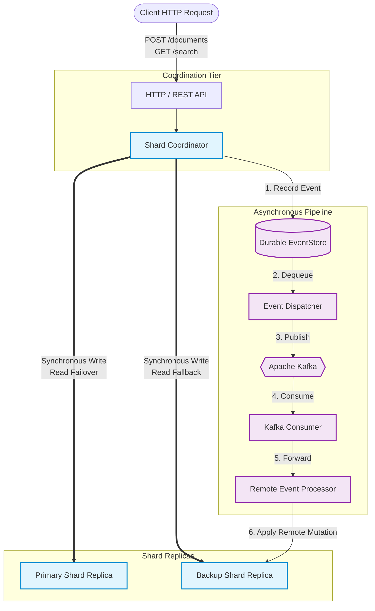
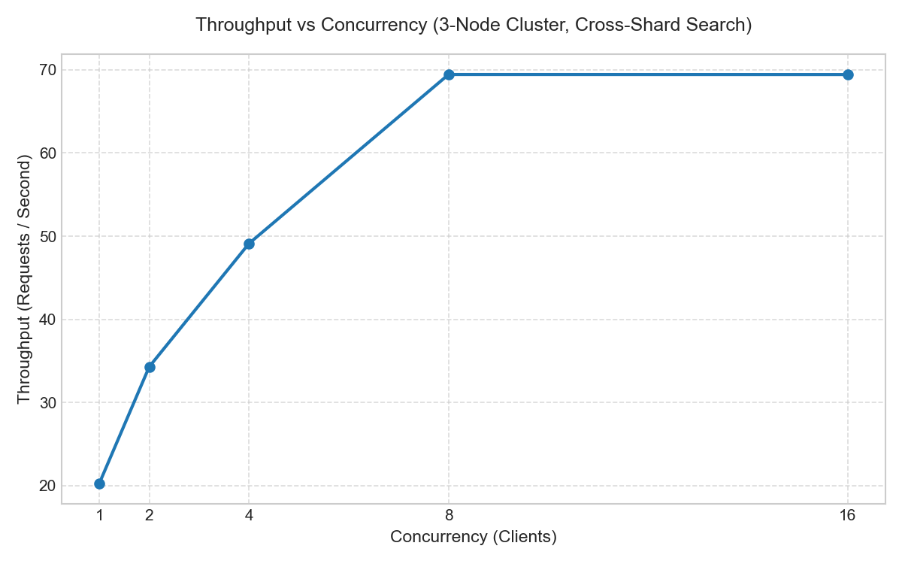
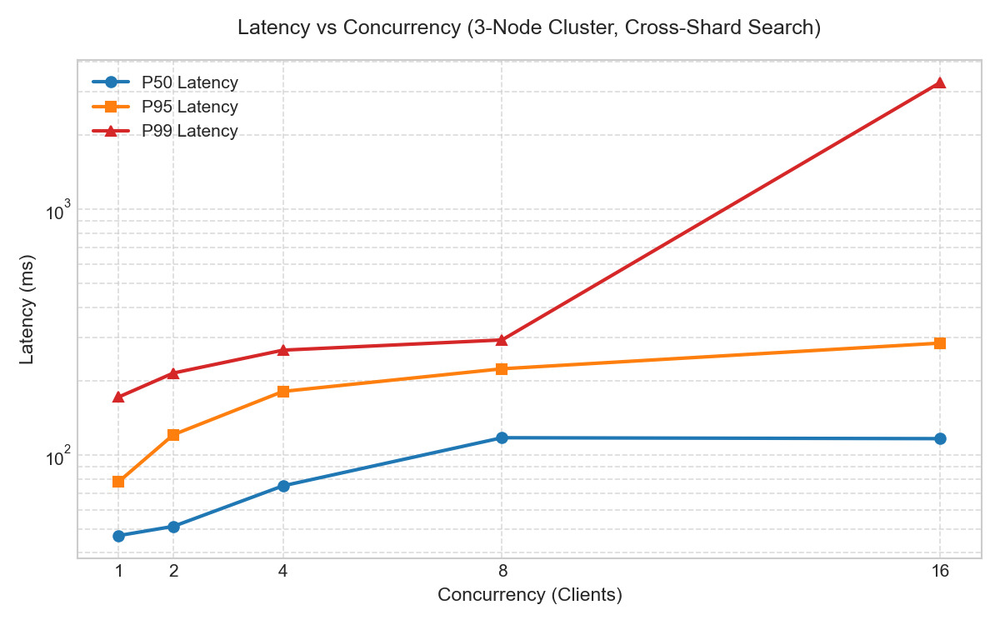
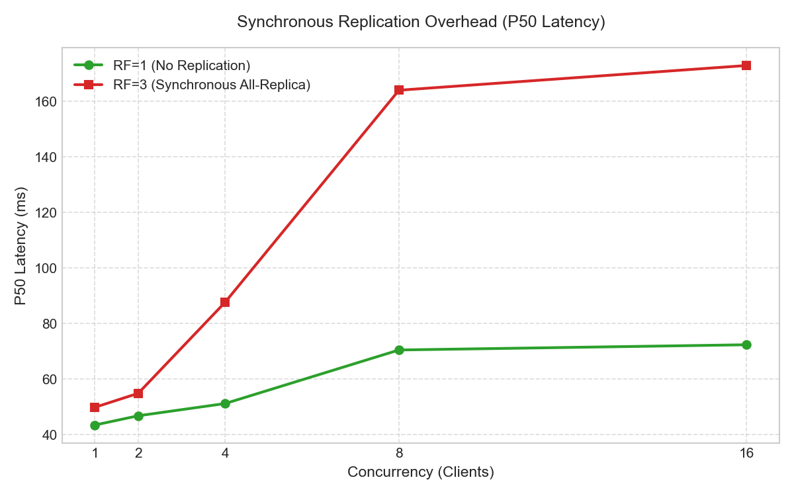

# Distributed Search Engine (DSE)

A scalable, fault-tolerant distributed search engine implemented from first principles in modern C++20.

[](https://github.com/daxsh2803/DistributedSearchEngine/actions/workflows/ci.yml)


---

## Overview

The Distributed Search Engine is a high-performance information retrieval system built entirely from scratch without external search platform dependencies (no Lucene, Elasticsearch, or Solr). It partitions documents across local shards, executes concurrent TF-IDF queries, maintains synchronous multi-replica fault tolerance, and streams domain events through an asynchronous Kafka outbox pipeline.

## Objectives

- **First-Principles Systems Engineering:** Demonstrate deep understanding of core search engine algorithms (inverted indexing, term ranking) and distributed system patterns (sharding, synchronous replication, read failover).
- **Two-Tier Authority Model:** A strict separation between the authoritative synchronous write path and an asynchronous event propagation side-channel.
- **Robust Reliability:** Comprehensive handling of node crashes, Kafka outages, network partitions, and query overload via circuit breakers, load shedding, and bounded exponential backoff retries.
- **In-Process Telemetry:** High-performance, atomic/in-process metrics collection without heavy external daemons.

## High-Level Architecture

The architecture enforces a clean separation of concerns. Synchronous all-replica replication guarantees authoritative cluster state, while the durable outbox asynchronously broadcasts events.



## Distributed System Design

- **Sharding & Hashing:** Documents are partitioned across $S$ logical shards using modulo-based hashing.
- **Synchronous Replication:** The `ShardCoordinator` acts as the authoritative tier. Writes require all configured replicas ($R$) to succeed synchronously before returning HTTP 201.
- **Read Failover:** Scatter-gather queries transparently fall back to secondary replicas if a primary shard node fails or trips a circuit breaker.
- **Partial-Availability Semantics:** If an entire shard partition is offline, the system degrades gracefully, returning partial results with metadata detailing the failure.
- **Durable EventStore (Outbox Pattern):** Document mutations append an event to a local persistent outbox. This decouples the search write-path from Kafka availability. Kafka outages do not impact synchronous index operations.
- **Asynchronous Propagation:** `EventDispatcher` asynchronously drains the outbox to Apache Kafka `documents.mutations`. Remote nodes consume these events via `KafkaConsumer` and apply them to local fallback shards. 
- **Bounded Queues & Load Shedding:** HTTP endpoints utilize `RequestSlotGuard` concurrency limits (HTTP 429 shedding) to prevent resource exhaustion under heavy saturation.

## Technology Stack

| Category | Technology |
| :--- | :--- |
| **Language** | Modern C++20 |
| **Build & Test** | CMake 3.24, GoogleTest |
| **Concurrency** | `std::shared_mutex` (RW locks), Atomics |
| **Networking/API** | `cpp-httplib`, REST JSON (`nlohmann/json`) |
| **Messaging** | Apache Kafka 4.3.1 (KRaft), `librdkafka` |
| **Persistence** | Append-only JSONL document store |
| **Containerization** | Docker, Docker Compose |

## Performance

The system was evaluated using an automated benchmarking suite (Benchmarks A–J) on a containerized 3-node topology ($N=3, S=3$).

### Throughput & Concurrency
Throughput scales cleanly up to hardware saturation without lock contention.



### Latency Profiles
P50 and P99 latency percentiles during sustained cross-shard scatter-gather queries.



### Replication Overhead
Direct latency comparison of non-replicated operations ($R=1$) against synchronous all-replica replication ($R=3$).



## Reliability & Validation

The system architecture and fault-tolerance semantics were rigorously proven via a comprehensive regression suite.

- **Status:** **1085 / 1085 automated tests passed (100%)**.
- **Validated Failure Scenarios:**
  - Complete primary node crashes (triggers automatic read failover).
  - Total Kafka broker outages (outbox gracefully queues events as `FAILED`; explicit replay ensures eventual consistency).
  - Partial network partitions triggering circuit breakers.
  - Saturated consumer groups backing off sequentially during handler exceptions.
  - Hard restarts testing complete persistent state recovery.

*Note: The system guarantees at-least-once asynchronous event delivery. It explicitly does not implement global consensus (Raft/Paxos), distributed transactions (2PC), or exactly-once semantics.*

## Running Locally

### Prerequisites
- C++20 compiler (MSVC 2022 / GCC 11+ / Clang 13+)
- CMake 3.24
- Docker & Docker Compose (required for Kafka integration)

### Configuration A: Standard Build (In-Memory Fallback)
```bash
cmake -B build -S .
cmake --build build --config Debug

# Run the 1085-test regression suite
ctest --test-dir build -C Debug --output-on-failure
```

### Configuration B: Kafka-Enabled 3-Node Cluster
To run the full replicated cluster with Kafka via Docker Compose:
```bash
# Start Kafka broker and 3 DSE nodes
docker compose -f docker/docker-compose.cluster.yml up -d --build

# View cluster status (Node 0: 8080, Node 1: 8081, Node 2: 8082)
docker compose -f docker/docker-compose.cluster.yml ps
```

For full details, refer to the [Operational Runbook](docs/operational-runbook.md).

## Documentation

The authoritative Phase 30 design documentation can be found in the `docs/` directory:

- **[Architecture Blueprint](docs/architecture-blueprint.md):** Complete data flow and component interactions.
- **[Operational Runbook](docs/operational-runbook.md):** 23-step reproducible cluster deployment and recovery guide.
- **[API & Metrics Reference](docs/api-and-metrics-reference.md):** Exhaustive JSON payload formatting and telemetry dictionary.
- **[Failure Semantics](docs/failure-semantics.md):** System failure matrix and empirical non-guarantees.
- **[ADR Index](docs/adr-index.md):** Architecture Decision Records (ADR-001 through ADR-018).
- **[Project Structure](docs/project-structure.md):** Codebase layout and responsibility mapping.
- **[Phase Status Map](PROJECT_STATUS.md):** Milestone history and verification record.
- **[End-to-End Demonstration](docs/demos/end-to-end-demo.md):** Permanent record of the live cluster E2E verification.

## Project Status

**Project status: Complete — Phase 30 is the final project milestone.**

All 30 developmental phases have been successfully implemented, benchmarked, and documented. The 1085-test suite serves as the final validation. No further architectural phases (i.e. Phase 31+) are planned, and the production source code is frozen.
