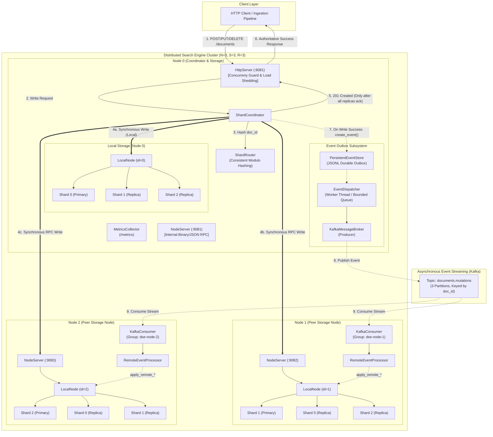
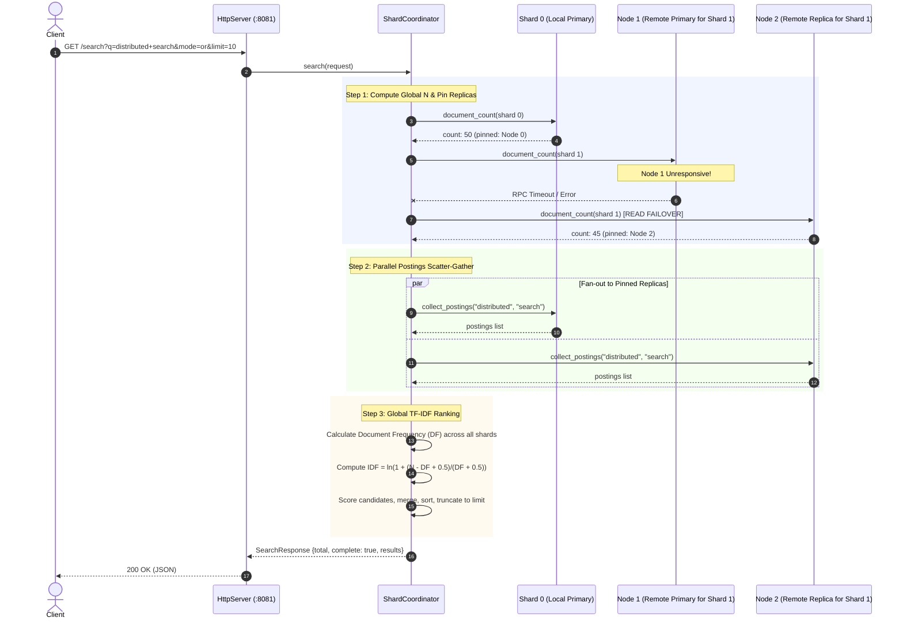

# Distributed Search Engine — Architecture Blueprint

This document provides the authoritative architectural blueprint of the Distributed Search Engine (DSE) as completed through Phase 30. It describes the core design principles, cluster topology, internal subsystems, and data flows, with explicit separation between the authoritative synchronous write tier and the asynchronous event outbox tier.

---

## 1. System Architecture Overview

The Distributed Search Engine is a multi-node, shard-partitioned information retrieval system implemented from first principles in C++20. It requires zero external search dependencies (no Lucene, Solr, Elasticsearch, or OpenSearch) and enforces clear separation between authoritative synchronous state and asynchronous event streaming.



---

## 2. Core Architectural Subsystems

### 2.1 Storage & Indexing Engine (In-Process)
Each physical node hosts one or more logical shard partitions managed by `LocalNode`:
- **`Tokenizer`:** Transforms raw UTF-8 document content into normalized, lower-case alphabetic tokens (filtering punctuation and whitespace).
- **`InvertedIndex`:** Thread-safe in-memory posting list mapping `term -> std::vector<Posting>`, where each `Posting` records `{doc_id, term_frequency}`. Concurrency is governed by `std::shared_mutex` (concurrent reads, exclusive writes).
- **`DocumentStore`:** Thread-safe key-value store mapping `doc_id -> Document` (storing original raw content and document length).
- **Persistence (`Shard`):** Append-only JSONL files (`shard-X/documents.jsonl`). On startup, shards rebuild their inverted indexes and document stores directly from persisted log entries.

### 2.2 Sharding & Node Routing
- **Partitioning (`ShardRouter`):** Maps integer document identifiers (`doc_id`) to logical shard IDs using uniform deterministic hashing: `shard_id = doc_id % shard_count`.
- **Placement (`ShardReplicaPlacement`):** Computes deterministic replica assignments for $N$ nodes, $S$ shards, and replication factor $R$:
  $$\text{replica\_nodes}(sid) = \{(sid + r) \pmod N \mid r \in [0, R)\}$$
  The primary replica is designated as $r=0$.
- **Node Client Interface (`NodeClient`):** Pure abstract interface decoupling coordinator logic from transport.
  - `LocalNode`: Direct in-process method dispatch to locally hosted shards.
  - `RemoteNode`: HTTP/RPC transport wrapper communicating with remote `NodeServer` instances over persistent connections, instrumented with `RetryPolicy` and `CircuitBreaker`.

### 2.3 Coordinator Tier (`ShardCoordinator`)
The coordinator acts as the distributed brain:
1. Receives client mutations and queries from `HttpServer`.
2. Coordinates synchronous write replication across replica sets.
3. Performs parallel search scatter-gather across all shards.
4. Manages read failover and query-local replica pinning.
5. Emits lifecycle-tracked domain events to the outbox upon successful mutation.

---

## 3. Two-Tier Authority Model

A defining architectural principle of the Distributed Search Engine is the absolute separation of the **Authoritative Synchronous Write Path** from the **Asynchronous Event Path**.

### 3.1 Authoritative Synchronous Write Path (Phase 17)

All write mutations (`POST /documents`, `PUT /documents/:id`, `DELETE /documents/:id`) execute through synchronous all-replica replication:

```
Client
  │
  ▼ (HTTP POST/PUT/DELETE)
HttpServer (concurrency slot acquired)
  │
  ▼
ShardCoordinator::ingest / update / remove
  │
  ├─► ShardRouter::route(doc_id) ──► identifies logical shard_id
  ├─► ShardReplicaPlacement::replicas_for_shard(shard_id) ──► identifies {node_ids}
  │
  ├─► Parallel Fan-Out (std::async) to ALL replicas:
  │     ├─► NodeClient (LocalNode)   ──► Shard::add_document / update / remove
  │     └─► NodeClient (RemoteNode)  ──► NodeServer RPC on peer nodes
  │
  ▼
Collect Results:
  ├─► If ALL replicas acknowledge success:
  │     ├─ Record write metrics (latency, count)
  │     ├─ Trigger outbox event creation (EventStore::create_event)
  │     └─ Return HTTP 201/200/204 to client (AUTHORITATIVE SUCCESS)
  │
  └─► If ANY replica fails:
        ├─ Record write error in metrics
        ├─ Do NOT enqueue outbox event
        └─ Return HTTP 400/500 to client (WRITE REJECTED)
```

**Key Guarantees & Constraints:**
- **Authoritative:** A write is only acknowledged as successful when **all** configured replicas for that shard confirm local execution and disk append.
- **No 2PC or Consensus:** There is no two-phase commit (2PC) or distributed rollback. If a replica fails midway through parallel fan-out, the surviving replicas retain the mutation, and the client receives an error. Consistency reconciliation across partitions is repaired via administrative re-sync or persistence reload.
- **Independent of Messaging:** Apache Kafka is **not** consulted and does **not** participate in write acknowledgments. If Kafka is completely down, synchronous writes continue to succeed with zero disruption to clients.

### 3.2 Asynchronous Event Path (Phases 18–19)

Once (and only once) an authoritative write succeeds, a domain event is created for asynchronous downstream processing:

```
ShardCoordinator (Write Succeeded)
  │
  ▼
PersistentEventStore::create_event(topic, key, payload)
  │   - Assigns permanent, immutable EventId (monotonically increasing)
  │   - Sets status = EventStatus::PENDING
  │   - Persists event record to disk (data/events/events.jsonl)
  │
  ▼
EventDispatcher::enqueue_with_event(event_id, topic, key, payload)
  │   - Enqueues into bounded in-memory queue (capacity: 4096)
  │   - Marks status = EventStatus::DISPATCHING
  │
  ▼ [Worker Thread]
KafkaMessageBroker::publish(message)
  │   - Delivers message to librdkafka producer
  │   - Routes to topic 'documents.mutations', keyed by doc_id
  │
  ├─► Kafka ACK Received:
  │     └─► EventStore::mark_published(event_id) (status = PUBLISHED)
  │
  └─► Kafka Broker Down / Max Retries (3) Exhausted:
        ├─► EventStore::mark_failed(event_id, error) (status = FAILED)
        ├─► Event remains safely persisted on disk
        └─► NO automatic retry loop is triggered upon Kafka recovery
```

**Downstream Consumption (`RemoteEventProcessor`):**
1. Each node runs a `KafkaConsumer` joined to an independent consumer group (`dse-node-<node_id>`).
2. Consumed events are decoded by `RemoteEventProcessor`.
3. **Loopback Protection:** If `event.source_node_id == own_node_id`, the event originated on this node and is skipped (`events_self_skipped_` incremented; offset committed).
4. For remote events, mutations are applied directly to local shards via `LocalNode::apply_remote_*()`, which updates local data structures without emitting secondary events or triggering replication.

---

## 4. Query & Search Path (Phases 3, 11, 24, 25)

The search path executes a distributed scatter-gather operation with global TF-IDF calculation and dynamic replica failover.



### 4.1 Read Failover & Replica Pinning (Phase 24)
When gathering shard document counts or postings:
1. `ShardCoordinator` queries the primary replica first.
2. If the primary node fails (connection refused, timeout, or circuit open), the coordinator immediately tries the next healthy replica in that shard's replica set.
3. The coordinator increments `read_failovers_total` in `MetricsCollector`.
4. **Query-Local Pinning:** Whichever replica successfully responds to `document_count` is pinned for that specific query and used for subsequent `collect_postings` calls. This eliminates inter-replica race conditions and posting inconsistencies during a single query.

### 4.2 Partial-Availability Semantics (Phase 25)
If all replicas for a given shard are unreachable:
- The search query does **not** fail with an HTTP 500 error.
- The coordinator proceeds with the available shards, marks `complete = false`, and attaches structured failure records to the response (`errors: [{"shard_id": 1, "node_id": 1, "category": "count_failure", "message": "all replicas failed"}]`).
- **TF-IDF Skew Warning:** Because the global document count $N$ and document frequencies $DF$ are calculated over a subset of the cluster, relevance scores are approximate.

---

## 5. Concurrency, Resilience, and Edge Shedding

### 5.1 Concurrency Limits & Load Shedding (Phase 27)
`HttpServer` enforces an application-level concurrent request cap (`DSE_MAX_CONCURRENT_REQUESTS`, default: 64).
- Managed by `RequestSlotGuard` via atomic compare-and-swap (`std::atomic<std::size_t> active_requests_`).
- When concurrent requests exceed the configured threshold, incoming requests are rejected immediately with HTTP 429 (`Too many requests: concurrency limit reached`) and `load_shed_rejections_total` is incremented.
- Prevents thread exhaustion in `cpp-httplib`'s worker pool under burst traffic.

### 5.2 Circuit Breakers & Retries (Phases 13–14)
Remote RPC calls from `RemoteNode` to `NodeServer` are guarded by per-node circuit breakers:
- **States:** `Closed` (normal traffic), `Open` (failing, fast-fail RPCs), `HalfOpen` (probing single canary request).
- **Thresholds:** Configurable failure threshold (default: 5 failures) triggers `Open` state for a cooldown period (default: 5000 ms).
- **Retries:** Exponential backoff with jitter avoids thundering herd on recovering nodes.

---

## 6. Architectural Invariants

1. **No External Core:** The inverted index, tokenizer, query parser, ranker, document store, and shard coordinator are 100% native C++20.
2. **Synchronous Replication is Authoritative:** Writes require all configured replicas to ack before client return. Kafka is strictly an auxiliary notification outbox.
3. **No Automatic Event Replay:** When Kafka fails, events transition to `EventStatus::FAILED` in `PersistentEventStore`. Recovery of Kafka does **not** trigger automatic re-transmission; explicit invocation of `EventDispatcher::replay_failed()` is mandatory.
4. **Stable Event Identifiers:** Every event receives a monotonically increasing `EventId` upon creation that remains constant across all retries, disk restarts, and manual replays.
