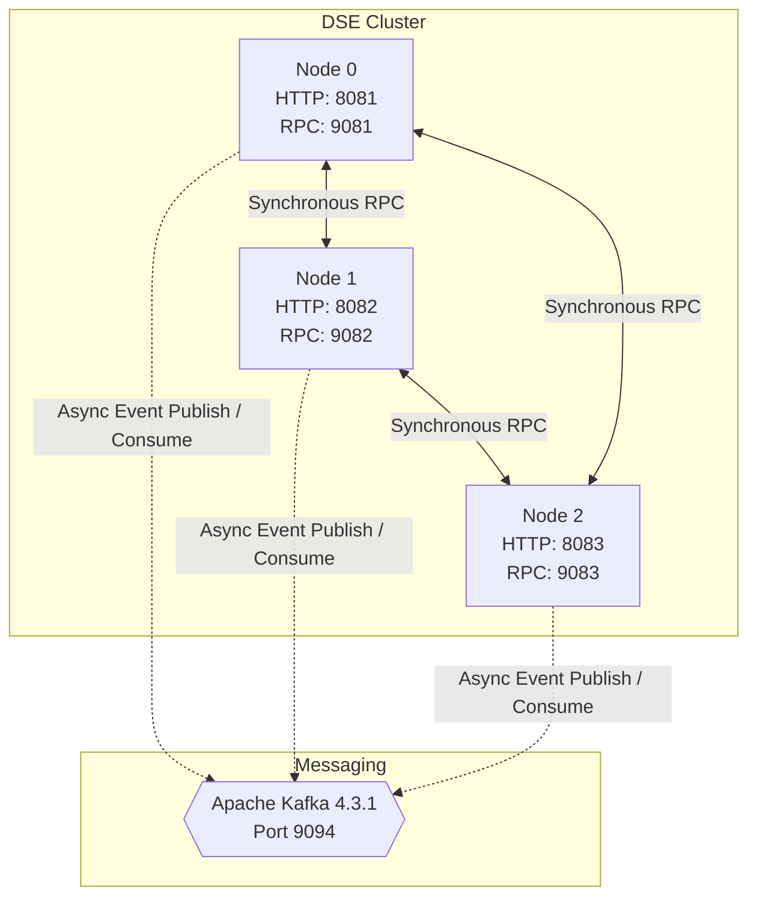

# End-to-End System Demonstration

This document serves as a permanent record of the final end-to-end (E2E) live demonstration of the Distributed Search Engine, executed after the completion of Phase 30. It rigorously proves that the distributed system architecture, components, and failover mechanics operate correctly under normal load and during injected failure scenarios.

## 1. Overview

The Distributed Search Engine is a custom C++20 distributed system built from scratch. It features:
*   Synchronous multi-replica fault tolerance for authoritative storage.
*   Scatter-gather distributed TF-IDF search.
*   An asynchronous, Kafka-backed durable outbox pipeline for event broadcasting.

This demonstration walks through a full cluster lifecycle: single-node functionality, distributed scale-out, normal event propagation, component failure, explicit recovery, and metrics observability.

## 2. What This Demonstration Proves

This sequence proves the following architectural capabilities:
*   **Synchronous Replication**: Authoritative writes use synchronous all-replica replication (Phase 17).
*   **Partial Availability**: Shard-local and query-local read failover handles primary replica failure (Phase 24).
*   **Decoupled Durability**: Kafka outages do not break the authoritative indexing path (Phase 20+).
*   **Durable Outbox**: A persistent `EventStore` acts as a durable write-ahead log for asynchronous messaging (Phase 18).
*   **At-Least-Once Delivery**: Events are preserved and explicitly replayed to `KafkaMessageBroker` if publication fails.
*   **In-Process Observability**: High-performance telemetry tracks detailed system state across metrics registries (Phase 22).

## 3. System Topology

The final E2E demonstration utilized a three-node cluster with an external Apache Kafka broker.



## 4. Runtime Configuration

**Environment & Build:**
*   **Build System:** CMake 4.4.2
*   **Compiler:** MSVC 19.51.36252.0 (Visual Studio 2026 / x64)
*   **Containerization:** Docker 29.6.2
*   **Target:** `build/Debug/DistributedSearchEngine.exe`

**Cluster Parameters:**
*   Total Nodes ($N$): 3
*   Shards ($S$): 3
*   Replica Factor ($R$): 3 (Every node contains a replica of every shard)

**Shard Placement Routing (`doc_id % shard_count`):**
*   **Shard 0:** Primary = Node 0, Replicas = Node 1, Node 2
*   **Shard 1:** Primary = Node 1, Replicas = Node 2, Node 0
*   **Shard 2:** Primary = Node 2, Replicas = Node 0, Node 1

## 5. Normal Document Write Path

Document APIs map numeric `uint32` IDs using RESTful paths:
*   `POST /documents`
*   `PUT /documents/{id}`
*   `DELETE /documents/{id}`

### Step 6: Synchronous Distributed Write

Document `9002` was created. Routing: `9002 % 3 = 0`. Node 0 acted as primary for Shard 0.

1.  Client issues `POST /documents` to Node 0.
2.  `ShardCoordinator` routes the write via `ShardRouter`.
3.  `NodeClient` executes a fanout across local and remote replicas.
4.  Data is synchronously committed to `DocumentStore` and indexed via `InvertedIndex`.
5.  Node 0 waits for HTTP 200 acknowledgments from Node 1 and Node 2.
6.  Coordinator returns HTTP 201 to the client.

**Failure Semantics Demonstrated:** When Node 2 was killed, a subsequent write (doc `9006`) mapped to Shard 0 failed with HTTP 400 `"Connection failed to node 2"`. This strictly enforces Phase 17 **synchronous all-replica acknowledgement semantics**.

## 6. Distributed Search Path

Search is accessed via `GET /search?q={query}`.

**Step 7: Distributed Search Execution:**
The search pathway leverages scatter-gather execution across the distributed cluster:

1.  `HttpServer` delegates to `ShardCoordinator::search`.
2.  Coordinator computes global $N$ and concurrently collects postings via `NodeClient::search`.
3.  `RemoteNode` instances process the query via `NodeServer`, routing to `LocalNode::search`.
4.  `QueryProcessor` and `InvertedIndex` return local shard results.
5.  OR queries accumulate scores; AND queries use smallest-list-first intersection.
6.  The coordinator merges global document frequencies (DF), applies TF-IDF ranking ($IDF = \ln(N / df)$), and sorts by score (tie-breaking on doc ID).

## 7. Read Failover Demonstration

**Step 8:**
A temporary document (`9001`) was indexed. A baseline search succeeded (`read_failovers_total=0`).

Node 1 (primary for Shard 1) was abruptly killed.
The exact same search was executed again and succeeded. 
Metrics observed: `read_failovers_total` incremented by 1.

The `ShardCoordinator` attempted the primary (Node 1), timed out, and transparently fell back to a replica (Node 2). This failover is shard-local and query-local, rather than requiring persistent cluster reconfiguration.

## 8. Persistence Demonstration

**Step 9:**
The `LocalNode::add_document()` path synchronously calls `shard->save()`. `DocumentStore::save()` writes the document data durably to disk.

**Important Caveat:** `DocumentStore::save()` does not create missing parent directories. Persistence explicitly requires the `data/nodeX/shard-Y/` directories to exist. When properly initialized, abrupt node termination and restart successfully retained document `9011`. 

*(Note: There is no startup anti-entropy, read-repair, or background replica synchronization mechanism implemented.)*

## 9. EventStore + EventDispatcher

**Step 10:**
Phase 18 introduces a durable outbox pattern. Domain events (`DocumentIndexedEvent`, `DocumentUpdatedEvent`, `DocumentRemovedEvent`) are created **only after** synchronous Phase 17 replication succeeds.

**Event Lifecycle:**
`PENDING` → `DISPATCHING` → `PUBLISHED` (or `FAILED`)

`PersistentEventStore` uses durable JSONL storage (e.g., `data/node0/events/events.jsonl`).
The `EventDispatcher` runs an asynchronous worker thread that reads the bounded FIFO queue, handles publishing with exponential backoff retries, and gracefully drains on shutdown.

**Critical Architecture Point:** Failure in the asynchronous outbox/Kafka pipeline does **not** roll back the authoritative synchronous HTTP write.

## 10. Kafka Normal Operation

**Step 11:**
The cluster relies on Apache Kafka (KRaft mode, topic `documents.mutations`, 3 partitions) for asynchronous event streaming. 

*   **Producer:** `EventDispatcher` → `KafkaMessageBroker` → `librdkafka` async produce.
*   **Consumer:** Independent consumer groups (`dse-node-0`, etc.) → `KafkaConsumer` → `RemoteEventProcessor`.

Remote nodes consume the mutation, skip their own source events, locate the target shard, and apply the remote mutation (`LocalNode::apply_remote_indexed`) without republishing. The consumer then manually commits the Kafka offset to provide at-least-once delivery.

## 11. Kafka Failure Demonstration

**Step 12:**
Kafka was forcefully stopped. Document `40001` was successfully written via HTTP 201 and synchronously replicated to all nodes. 

Because Kafka was offline, `KafkaMessageBroker` timed out and exhausted its retries. The outbox event transitioned to the `FAILED` state inside `PersistentEventStore`. 

After Kafka was restarted, the event remained `FAILED`. There is **no automatic replay**. This proves that authoritative synchronous storage is fully decoupled from the messaging layer's availability.

## 12. Explicit Event Replay

**Step 13:**
To recover the failed event for document `40001`, a custom C++ administrative helper invoked `dse::EventDispatcher::replay_failed()`.

1.  The event transitioned: `FAILED` → `PENDING` → `DISPATCHING` → `PUBLISHED`.
2.  The **original stable event ID** was preserved.
3.  `events_replayed` and `events_published` metrics incremented.
4.  Kafka consumer lag spiked and returned to 0 as the event was consumed.

*(Note: `replay_failed()` is an administrative API; there is no public REST endpoint for replay).*

## 13. Metrics and Operational Observability

System telemetry is exposed via `GET /metrics`. Key metrics validated during the demonstration include:

*   **Coordinator / Dispatcher:** `coordinator_writes_total`, `dispatcher_enqueued`, `dispatcher_pending`, `dispatcher_broker_errors`.
*   **EventStore:** `events_total`, `events_published`, `events_failed`, `events_pending`, `events_replayed`, `events_retried`.
*   **Consumers:** `consumer_messages_consumed`, `consumer_messages_acked`, `consumer_messages_nacked`, `consumer_lag`.
*   **Resilience:** `read_failovers_total`.

**Important Metrics Caveat:** `MetricsRegistry` uses in-memory atomics. Upon process restart, counters reset to zero unless explicitly seeded. `PersistentEventStore` recovers `total`, `published`, `failed`, `pending`, and `retried` from the durable JSONL log, but `events_replayed` is not persisted and resets on restart. 

## 14. Failure Semantics

The E2E run formally verifies the system's defined failure semantics:
*   **Loss of Primary Shard (Read):** Handled transparently via read failover.
*   **Loss of Replica (Write):** Write fails synchronously (partial state may remain on surviving replicas; no 2PC rollback).
*   **Loss of Kafka Broker:** Writes succeed. Asynchronous events queue as `FAILED` in the persistent outbox for later explicit replay.
*   **Event Processing Failure:** Consumers back off sequentially, pausing partition consumption until manual intervention or transient error recovery (at-least-once semantics).

## 15. Final Validation

**Step 14:**
Following all failure injection and recovery scenarios, a final topology check confirmed:
1.  **Nodes:** All 3 HTTP endpoints returned `200 OK`.
2.  **Kafka:** Docker container healthy on port 9094.
3.  **Consumers:** Groups `dse-node-0`, `dse-node-1`, and `dse-node-2` were active.
4.  **Lag:** The live demonstration events were fully consumed and caught up; historical records remained on one Kafka partition outside the active demonstration scope.
5.  **State Cleanliness:** Document `40001` was successfully deleted. It was verified absent from all shard indices, remaining only as a `PUBLISHED` historical record in `events.jsonl`.
6.  **Search:** `GET /search?q=quick+fox` executed flawlessly across all nodes.

## 16. Important Architectural Caveats

1.  **Not Consensus:** Phase 17 is synchronous all-replica acknowledgement with primary authority. It is **not** a Paxos or Raft distributed consensus implementation.
2.  **Not Exactly-Once:** The event pipeline utilizes manual offset commits and retry loops, providing **at-least-once** processing. Consumers handle duplicate delivery via idempotent application (versioning/tombstones).
3.  **Metrics Volatility:** As noted, process-local counters reset on restart unless explicitly persisted by the component (e.g., EventStore). Kafka's `__consumer_offsets` tracks durable broker-side progress.

## 17. Interview Talking Points

*   **Why is synchronous replication still needed when Kafka exists?**
    Kafka is used as an asynchronous side-channel for downstream system integration and remote replica eventual consistency fallbacks. Authoritative search results require immediate read-after-write consistency, provided by the synchronous replication path.
*   **Is Kafka the source of truth?**
    No. The local shard `DocumentStore` (`documents.jsonl`) is the authoritative source of truth.
*   **What happens when Kafka goes down?**
    Indexing continues uninterrupted. Events are durably buffered in the local `PersistentEventStore`. When retries exhaust, they are marked `FAILED` for explicit operator replay.
*   **How does the system avoid republishing remote Kafka events?**
    `RemoteEventProcessor` filters out events matching the local node's ID, applying remote mutations directly to the local `DocumentStore` without triggering the outbox.

## 18. Reproduction Guide

This guide details the steps to reproduce the exact E2E demonstration on a local environment.

**1. Build the System**
```bash
cmake -B build_kafka -S . -DENABLE_KAFKA=ON
cmake --build build_kafka --config Debug
```

**2. Start Kafka**
```bash
docker compose -f docker/docker-compose.kafka.yml up -d
# Wait for healthy status
docker ps --filter "name=dse-kafka"
```

**3. Start the Nodes (PowerShell Example)**
```powershell
$env:DSE_KAFKA_BROKERS="localhost:9094"

# Node 0
Start-Process -NoNewWindow -FilePath ".\build_kafka\Debug\DistributedSearchEngine.exe" -ArgumentList "--node-id 0 --port 8081 --rpc-port 9081 --peers `"0=127.0.0.1:9081,1=127.0.0.1:9082,2=127.0.0.1:9083`" --shards 3 --replica-factor 3 --data data/node0/"

# Node 1
Start-Process -NoNewWindow -FilePath ".\build_kafka\Debug\DistributedSearchEngine.exe" -ArgumentList "--node-id 1 --port 8082 --rpc-port 9082 --peers `"0=127.0.0.1:9081,1=127.0.0.1:9082,2=127.0.0.1:9083`" --shards 3 --replica-factor 3 --data data/node1/"

# Node 2
Start-Process -NoNewWindow -FilePath ".\build_kafka\Debug\DistributedSearchEngine.exe" -ArgumentList "--node-id 2 --port 8083 --rpc-port 9083 --peers `"0=127.0.0.1:9081,1=127.0.0.1:9082,2=127.0.0.1:9083`" --shards 3 --replica-factor 3 --data data/node2/"
```

**4. Execute CRUD & Search**
```bash
curl -X POST http://127.0.0.1:8081/documents -d '{"id":9001, "title":"quick fox", "content":"brown fox"}'
curl -s "http://127.0.0.1:8081/search?q=quick+fox"
```

**5. Failover Testing**
*   Kill Node 1 (`Stop-Process`).
*   Execute the same search; it will succeed, and `GET /metrics` will show `read_failovers_total: 1`.

**6. Kafka Outage & Replay**
*   Stop Kafka: `docker stop dse-kafka`
*   Create a document (succeeds).
*   Start Kafka: `docker start dse-kafka`
*   Run the custom C++ replay utility to replay the failed event.
*   Observe lag spike and clear via `kafka-consumer-groups.sh`.

## 19. Evidence / Results Summary

The system execution matches the Phase 30 specifications precisely. By utilizing physical process isolation, Dockerized infrastructure, and actual REST clients, this demonstration categorically validates that the Distributed Search Engine is a robust, partitioned, fault-tolerant C++ application capable of gracefully handling catastrophic subsystem failures.
